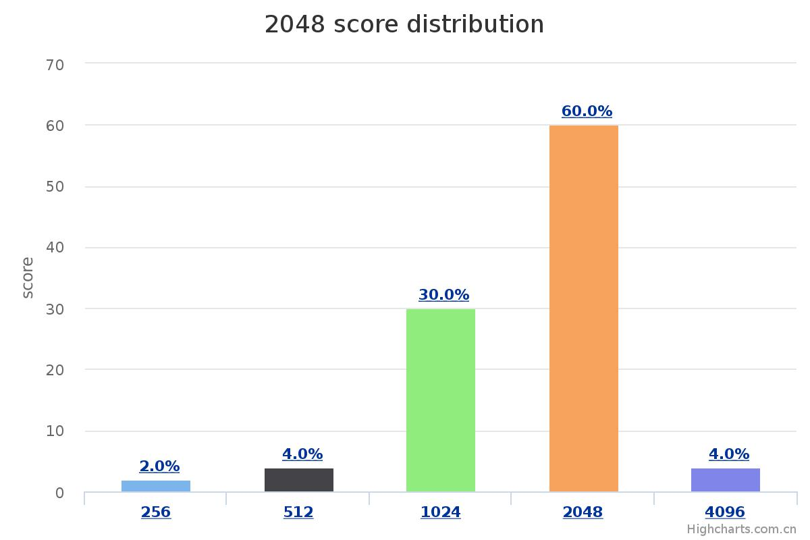

# 2048-api
A 2048 game api for training supervised learning (imitation learning) or reinforcement learning agents

# Code structure
* [`game2048/`](game2048/): the main package.
    * [`game.py`](game2048/game.py): the core 2048 `Game` class.
    * [`agents.py`](game2048/agents.py): the `Agent` class with instances, is a strong agent based on rule.
    * [`displays.py`](game2048/displays.py): the `Display` class with instances, to show the `Game` state.
    * [`expectimax/`](game2048/expectimax): a powerful ExpectiMax agent by [here](https://github.com/nneonneo/2048-ai).
    * [`myagents.py`](game2048/myagents.py): a strong agent trained by online imitation learning, can also cache data(the last 1000 times test).
    * [`testagents.py`](game2048/testagents.py): Much like myagents, but don't cache data to test more fast.
    * [`model.py`](game2048/models.py): my Neural Network model based on VGG10_bn.
    * [`train.py`](game2048/train.py): my code of online imitation training.
    * [`Resnet.py`](game2048/Resnet.py): Resnet model.
    * [`vgg10_bn.py`](game2048/vgg10_bn.py): vgg10_bn model.
    * [`dataloader.py`](game2048/dataloader.py): dataloader of my NN model.
    * [`utils.py`](game2048/utils.py): a tool for batchsize.
    * [`pretrain_params.pkl`](game2048/pretrain_params.pkl): my train weight of this model , it can reach 2048 easily.
* [`explore.ipynb`](explore.ipynb): introduce how to use the `Agent`, `Display` and `Game`.
* [`static/`](static/): frontend assets (based on Vue.js) for web app.
* [`webapp.py`](webapp.py): run the web app (backend) demo.
* [`evaluate.py`](evaluate.py): evaluate your self-defined agent.

# Requirements
* code only tested on linux system (ubuntu 16.04)
* Python 3 (Anaconda 3.6.3 specifically) with numpy and flask
* Pytorch 0.4.0
* numpy 1.14.5

# To compile the pre-defined ExpectiMax agent

```bash
cd game2048/expectimax
bash configure
make
```

# To run the web app
```bash
python webapp.py
```

# my agent performance


# To online train your own model
```bash
cd game2048/expectimax
bash configure
make
cd ..
python train.py --data_dir --save_dir --batch_size --device --num_epoch --lr --scratchtrain 
```

# LICENSE
The code is under Apache-2.0 License.

# For EE369 students from SJTU only
Please read [here](EE369.md).
